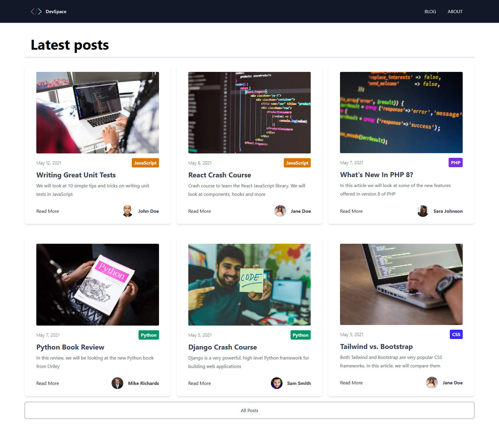
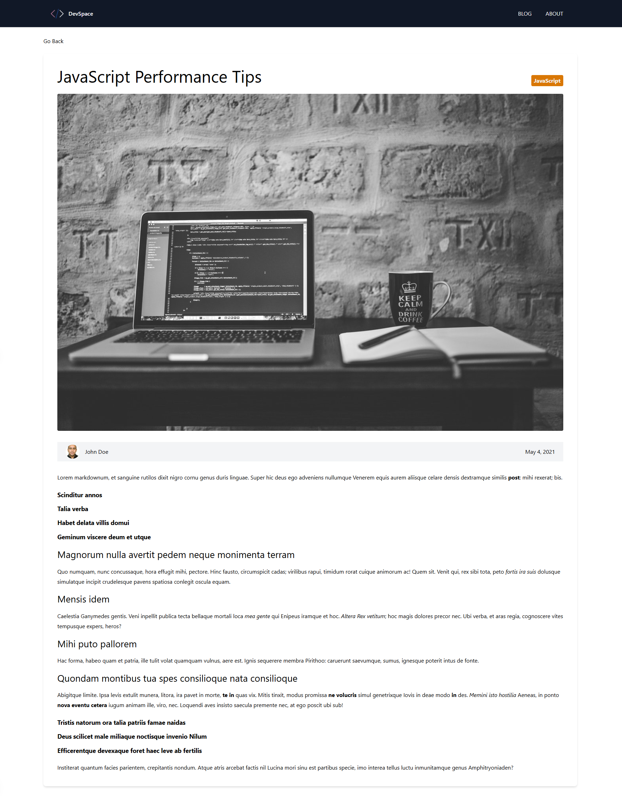

# 🚀 DevSpace

> This is a developers blog website built with Next.js.

[](LICENSE)
[]()

---

## 📸 Demo / Screenshots

<p align="center">
  
  
</p>

---

## 📖 Table of Contents

- [About](#About)
- [Features](#features)
- [Tech Stack](#tech-stack)
- [Installation](#installation)
- [Usage](#usage)

---

## 📜 About

This was one of my first NextJS projects, this project was exclusively
used to explore what NextJS is about, and exploring the file based routing.

---

## ✨ Features

- ✅ Categorize blog posts
- ✅ Navigate to different posts
- ✅ Load more posts

---

## 🛠 Tech Stack

**Frontend:** Next.js, TailwindCSS  
**Backend:** Next.js
**Database:** None

---

## ⚙️ Installation

```bash
# Clone the repo
git clone https://github.com/Daneelv/Nextjs-devspace-blog.git

# Install dependencies
npm install

# Run locally
npm run dev
```
